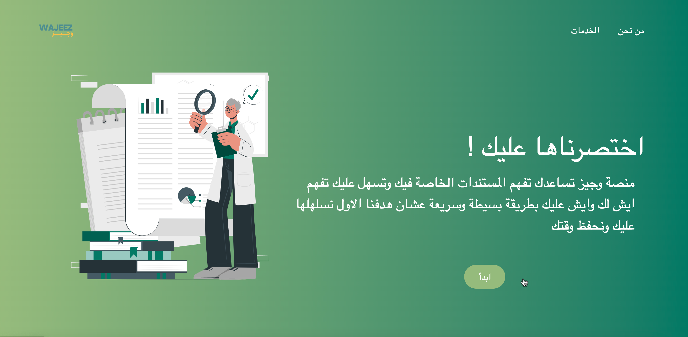

<h1 align="center">Welcome to Wajeez 👋</h1>
<p>
  
  <a href="#" target="_blank">
    
  </a>
</p>

> Wajeez is a web application that analyzes legal documents
and texts and converting them into 
simplified texts containing a summary of the document or text.



----

## Prerequisites

Wajeez app uses **NextJS** as a frontend framework, and **NodeJS** as backend.

## 📖 Installation

### backend
```
$ git clone https://github.com/kamel402/wajeez.git
$ cd wajeez/wajeez-backend
$ npm i
$ node index.js
```

### frontend
```
$ cd wajeez/wajeez-frontend
$ npm i
$ npm run dev
```

## License

[GNU General Public License v3.0](LICENSE)